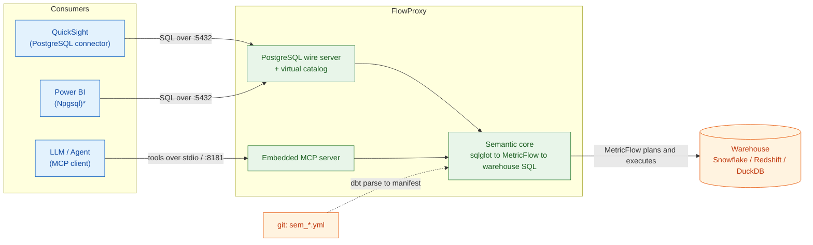
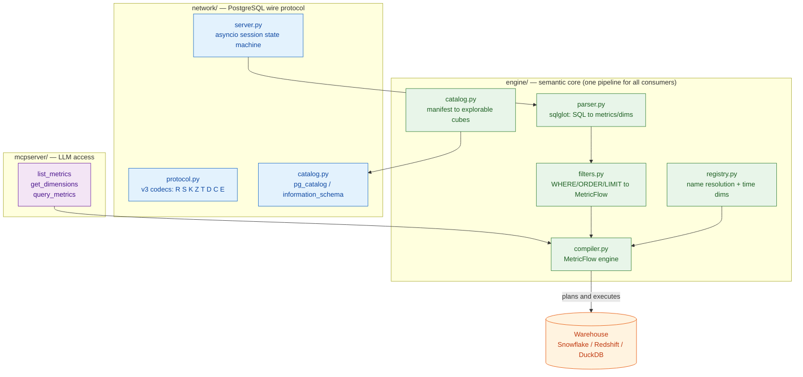
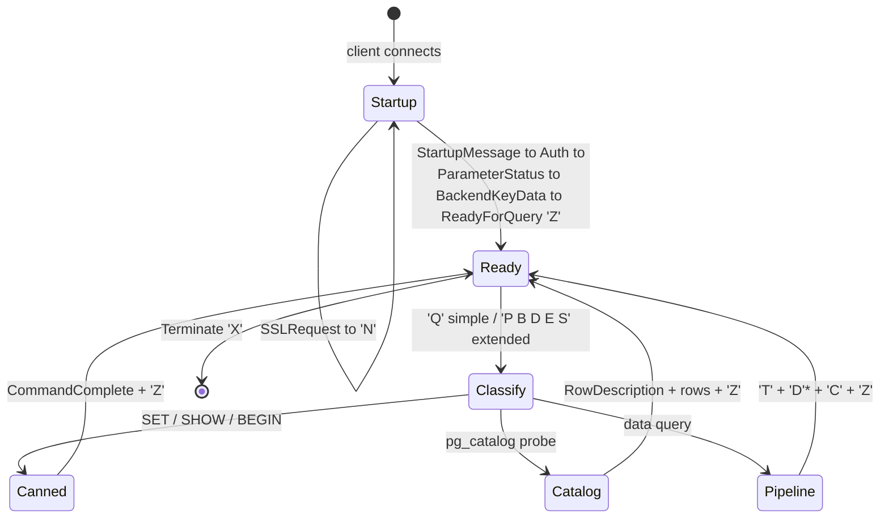
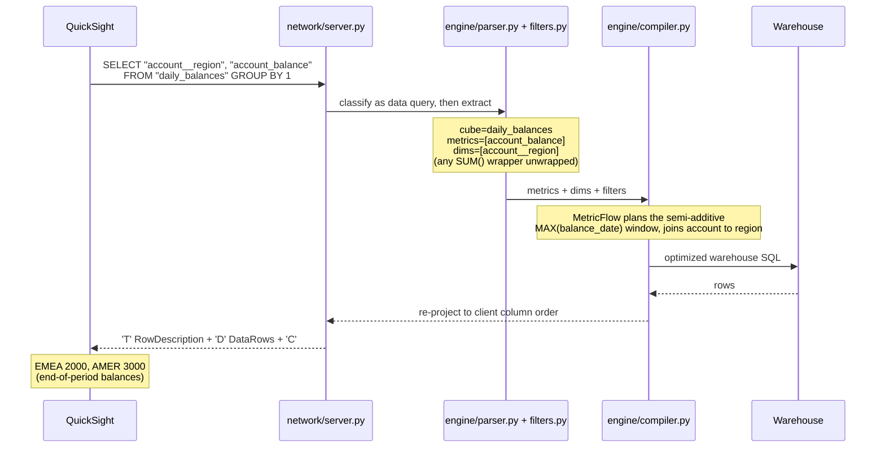
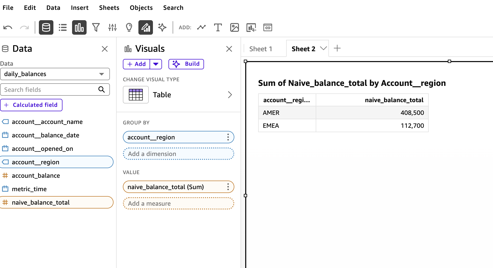
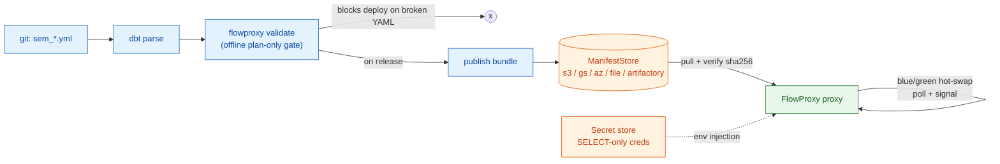

# FlowProxy

**A self-hosted semantic proxy for dbt-core + MetricFlow — makes your `sem_*.yml` semantic layer explorable from Amazon QuickSight and queryable by an LLM, with the guardrails in your metric definitions (semi-additivity, valid join paths) enforced automatically. Built for air-gapped enterprises. No dbt Cloud, no custom BI drivers.**

[](LICENSE)
[](pyproject.toml)
[](docs/adr/0002-oss-dbt-core-metricflow-stack.md)
[](docs/adr/0002-oss-dbt-core-metricflow-stack.md)
[](tests/)
[](#production-deployment)

FlowProxy fills the role of Cube.dev or the dbt Cloud Semantic Layer, built natively on open-source **dbt-core** and **MetricFlow** and running fully **offline**. BI tools connect with their stock **PostgreSQL** connector — no custom driver, no SPICE, no dbt Cloud subscription. An analyst drags metrics and dimensions onto a visual; FlowProxy intercepts the SQL, re-plans it through MetricFlow, executes the optimized query in your warehouse, and streams rows back over the native PostgreSQL wire protocol. An LLM reaches the same semantic layer through an embedded, dbt-mcp-compatible MCP server — and through the same guardrails.


<sub>A dbt-core + MetricFlow semantic layer, sliced by an analyst in Amazon QuickSight over the PostgreSQL wire protocol — running air-gapped on AWS from a CI-published bundle. The `Sum` is QuickSight's; the number is the semi-additive **end-of-period** balance, because the metric's guardrail is enforced at query time (see [The guardrail, proven](#the-guardrail-proven)).</sub>

---

## Why this exists

QuickSight and Power BI have no native dbt Semantic Layer support outside dbt Cloud, which is unusable in an air-gapped bank. Teams are left copying metric logic into each BI tool, where it drifts and where a semi-additive balance quietly gets `SUM()`-ed into a wrong number.

FlowProxy gives the standard PostgreSQL connector a governed semantic layer to talk to. The metric definitions checked into git **are** the guardrails: because every request is re-planned through MetricFlow rather than passed through as raw SQL, neither an analyst nor an LLM can bypass them.

- **One definition, everywhere.** `sem_*.yml` in git is the single source of truth for QuickSight, Power BI, and LLM agents alike.
- **Guardrails that hold.** `non_additive_dimension`, join-path validity, and metric aggregation are enforced by MetricFlow — a BI-emitted `SUM()` cannot defeat them.
- **Air-gap native.** No dbt Cloud, no telemetry, SELECT-only runtime credentials from your secret store, reproducible pinned dependencies.
- **Governed deploys.** A CI gate plans every metric offline and blocks a broken `sem_*.yml` before it reaches production; the runtime hot-swaps new versions with zero downtime.

---

## Mental model



<sub>* Power BI / Npgsql discovery is stubbed (deferred); QuickSight is supported today.</sub>

**The load-bearing property:** every consumer — QuickSight, Power BI, an LLM — funnels through the *same* `engine/compiler.py` pipeline (validate to MetricFlow plan to execute). No path runs raw user SQL against the warehouse, so the semantic guardrails cannot be bypassed by any client.

---

## Table of contents

- [What you get](#what-you-get)
- [Architecture](#architecture)
- [How a query flows](#how-a-query-flows)
- [The guardrail, proven](#the-guardrail-proven)
- [Quick start](#quick-start)
- [Connecting BI tools](#connecting-bi-tools)
- [LLM access (MCP)](#llm-access-mcp)
- [Production deployment](#production-deployment)
- [Configuration](#configuration)
- [Repository layout](#repository-layout)
- [Testing](#testing)
- [Design decisions](#design-decisions)
- [Status and roadmap](#status-and-roadmap)

---

## What you get

| Capability | Description |
|---|---|
| **PostgreSQL wire server** | Emulates a PostgreSQL 15 backend (simple + extended query protocols) over `asyncio`. QuickSight and Power BI connect with the stock PG connector. |
| **MetricFlow compilation** | Metric/dimension requests are planned by the real `metricflow` engine into optimized, dialect-correct warehouse SQL (Snowflake / Redshift / DuckDB). |
| **SQL interception** | Incoming BI SQL is parsed with `sqlglot`; metrics, dimensions, and filters are extracted and re-planned. Raw SQL is never passed through, so guardrails hold. |
| **Auto-cube exploration** | Each dbt semantic model appears as an explorable table (cube), pre-scoped to only valid fields so invalid slices cannot be built. Plus an `all_metrics` wide table and one cube per saved query. |
| **Filter / sort / limit** | `WHERE` / `ORDER BY` / `LIMIT` translate to MetricFlow constructs (`where` filters, time constraints). Injection-safe, deny-by-default. |
| **Semantic guardrails** | `non_additive_dimension` (semi-additive metrics), valid join paths, and metric aggregations are enforced by MetricFlow. A BI-emitted `SUM()` cannot defeat them. |
| **Embedded MCP server** | dbt-mcp-compatible `list_metrics` / `get_dimensions` / `query_metrics` tools let an LLM query the same semantic layer through the same guardrails. |
| **CI deploy gate** | `flowproxy validate` plans every saved query and cube offline (no warehouse) and blocks a deploy on a broken join path or renamed dimension. Publishes a versioned, integrity-checked bundle to an artifact store. |
| **Zero-downtime hot-swap** | The runtime consumes a bundle from the store (`s3://` / `gs://` / `az://` / Artifactory via `fsspec`) and blue/green-swaps new versions on poll or signal. No restart, no dropped connections, no `dbt parse` at runtime. |
| **Air-gap ready** | No dbt Cloud, no telemetry (`DO_NOT_TRACK`), pinned and locked dependencies, non-root container, SELECT-only runtime credentials from your secret store — never in the bundle. |

---

## Architecture



### Per-connection protocol state machine



---

## How a query flows

An analyst drags **Account Balance** and **Region** onto a QuickSight visual:



Every stage logs structured progress (`pipeline stage 1/3 ...`), so a request is traceable from raw packet to MetricFlow plan to warehouse rows.

---

## The guardrail, proven

The `finance_demo` fixture defines a **semi-additive** balance metric — summable across accounts, but not across time (you want the last balance in a period, not the sum of daily balances):

```yaml
# test_projects/finance_demo/models/semantics/sem_daily_balances.yml
measures:
  - name: month_end_balance
    agg: sum
    expr: eod_balance
    non_additive_dimension:        # the guardrail
      name: balance_date
      window_choice: max           # take the LAST balance in a period, not the sum
```

The semi-additive metric returns the **end-of-period balance**; a BI tool wrapping it in `SUM()` still gets the correct number, because FlowProxy re-plans through the metric definition rather than executing the client's SQL.

### Seeing it live in QuickSight

Two Amazon QuickSight visuals, built by the same drag-and-drop actions against the same cube, both with a `Sum` aggregation applied by QuickSight. The only difference is which metric is dragged in — and the numbers differ by ~135×, because the guardrail is enforced at query time:

| | |
|:--:|:--:|
|  |  |
| **`account_balance`** — the governed, semi-additive metric. End-of-period balances: **AMER 3,000 · EMEA 2,000**. | **`naive_balance_total`** — a naive `SUM` of daily snapshots: AMER 408,500 · EMEA 112,700. Meaningless as a balance. |

The analyst performed the **identical action** in both — dragged the field, left QuickSight's default `Sum`. On the governed metric there is no way to get the wrong number: MetricFlow's `non_additive_dimension` collapses each account's daily series to its end-of-period value, and the BI tool's `SUM()` is unwrapped and re-planned rather than executed. The metric author decided the semantics once, in YAML; no BI tool or analyst can override them.

This is asserted with exact values in [`tests/test_l3_golden_numbers.py`](tests/test_l3_golden_numbers.py), over a real socket in [`tests/test_ws3_quicksight_e2e.py`](tests/test_ws3_quicksight_e2e.py), and through the LLM path in [`tests/test_ws6_mcp.py`](tests/test_ws6_mcp.py). (Grouped by month, the semi-additive metric is 1500/1200/2000 for EMEA and 4000/4500/3000 for AMER; the naive sum is ~30× each.)

---

## Quick start

FlowProxy uses **[uv](https://docs.astral.sh/uv/)** for everything.

**1. Install**

```bash
uv sync --extra duckdb --group dev      # runtime + DuckDB warehouse + test deps
```

**2. Build the demo dbt project** (no external warehouse needed)

```bash
cd test_projects/finance_demo
DO_NOT_TRACK=1 uv run --project ../.. dbt build --profiles-dir .   # seeds + models to DuckDB
DO_NOT_TRACK=1 uv run --project ../.. dbt parse --profiles-dir .   # to target/semantic_manifest.json
cd ../..
```

**3. Run the proxy**

```bash
FLOWPROXY_DUCKDB_PATH="$PWD/test_projects/finance_demo/target/finance_demo.duckdb" \
FLOWPROXY_MANIFEST="$PWD/test_projects/finance_demo/target/semantic_manifest.json" \
FLOWPROXY_DBT_PROJECT_DIR="$PWD/test_projects/finance_demo" \
DO_NOT_TRACK=1 \
uv run python main.py
# semantic-stack compatibility matrix OK
# MetricFlow engine online
# virtual catalog ready: 5 cubes exposed under schema 'semantic_layer'
# flowproxy listening on ('0.0.0.0', 5432)
```

**4. Query it** with any PostgreSQL client

```bash
psql "host=127.0.0.1 port=5432 user=analyst dbname=flowproxy sslmode=disable" \
  -c 'SELECT "account__region", "account_balance" FROM "daily_balances" GROUP BY 1'
#  account__region | account_balance
# -----------------+-----------------
#  AMER            | 3000.0
#  EMEA            | 2000.0
```

> This is **DIRECT mode** — a local manifest and dbt project, ideal for development. For production, FlowProxy runs in **STORE mode**, consuming a validated bundle from an artifact store. See [Production deployment](#production-deployment).

---

## Connecting BI tools

### Amazon QuickSight (supported today)

1. **Datasets to New dataset to PostgreSQL.**
2. Host = FlowProxy address, Port = `5432`, Database = any name, SSL off (terminate TLS at a fronting NLB/stunnel), user/password per your config.
3. Choose **Direct query** — not SPICE, which issues `SELECT *` and has no semantic mapping.
4. In the schema `semantic_layer` you will see one **cube per dbt semantic model** (for example `daily_balances`, `transactions`), an **`all_metrics`** wide table, and one table per **saved query**.
5. Build an analysis by dragging metrics and dimensions onto a visual. Each cube exposes only fields that are valid for its metrics, so a broken slice cannot be built. Filters and date ranges push down to MetricFlow.

### Power BI (deferred)

The Npgsql `pg_type` bootstrap is currently a documented stub; QuickSight's discovery path does not depend on it. Power BI qualification is planned — see [ADR-0004](docs/adr/0004-virtual-catalog-from-saved-queries.md).

---

## LLM access (MCP)

FlowProxy embeds an MCP server exposing the **dbt-mcp-compatible** tool trio, so an LLM queries the semantic layer through the exact same guardrails as an analyst.

| Tool | Purpose |
|---|---|
| `list_metrics()` | Inventory of metrics: name, type, label, description |
| `get_dimensions(metrics)` | Dimensions valid for those metrics, plus time grains |
| `query_metrics(metrics, group_by?, where?, order_by?, limit?)` | Execute and return rows |

```bash
# stdio (local agent / desktop assistant)
FLOWPROXY_MANIFEST=... FLOWPROXY_DBT_PROJECT_DIR=... FLOWPROXY_DUCKDB_PATH=... \
uv run python -m mcpserver

# streamable-HTTP (internal agent gateway) — port 8181, never 5432
FLOWPROXY_MCP_TRANSPORT=streamable-http uv run python -m mcpserver
```

Point an MCP-capable assistant at it and ask *"what was the account balance by region in March?"* — it calls `list_metrics`, then `get_dimensions`, then `query_metrics`, and answers from governed data. MCP results are provably identical to the wire path ([`tests/test_ws6_mcp.py`](tests/test_ws6_mcp.py)).

---

## Production deployment

Production separates **producing** the semantic manifest (CI, which has the dbt project and warehouse-DDL access) from **consuming** it (the runtime proxy, which needs only a validated artifact and SELECT-only warehouse credentials). An artifact **bundle** sits between them in a `ManifestStore`.



### 1. The CI deploy gate

On every PR, run the **offline, plan-only** gate — it needs no warehouse:

```bash
uv run python -m flowproxy_cli validate <dbt_project_dir> --diff
# plans every saved query + auto-cube via MetricFlow explain;
# exits non-zero (deploy blocked) on a broken join path, renamed dimension, or removed metric.
```

On a **production release only**, publish a bundle to the store:

```bash
uv run python -m flowproxy_cli validate <dbt_project_dir> \
  --publish s3://bank-artifacts/flowproxy/production/ \
  --profiles-template <dbt_project_dir>/profiles.template.yml \
  --git-sha "$GITHUB_SHA" --built-at "$(date -u +%Y-%m-%dT%H:%M:%SZ)"
```

The shipped GitHub Actions workflow ([`.github/workflows/semantic-layer.yml`](.github/workflows/semantic-layer.yml)) wires exactly this: `validate` runs on every PR; `publish` is gated `if: github.event_name == 'release'`, so only a deliberate release mutates production.

### 2. The bundle

A compressed tar published under a git-SHA / checksum key. It carries **no secrets**:

```text
flowproxy-bundle-<gitsha>.tar
├── semantic_manifest.json     # the MetricFlow semantic graph (consumed)
├── metadata.json              # git sha, dbt/mf versions, sha256, validation report
├── profiles.template.yml      # adapter SHAPE only — creds injected at runtime
└── manifest.json              # (optional) full dbt manifest for lineage
```

Integrity is checked on fetch (bytes vs recorded sha256); a mismatch refuses to load. `metadata.json` makes every deployed answer traceable to the exact YAML version — the regulator's lineage question.

### 3. The runtime (STORE mode)

The production image consumes a bundle — **no `dbt parse`, no project mount**. It builds a minimal synthetic dbt skeleton internally, injecting warehouse credentials from the environment (populated by your secret store — Vault, Kubernetes Secrets, cloud SM), and blue/green-swaps new bundle versions without dropping connections.

```bash
docker build -t flowproxy .
docker run -p 5432:5432 \
  -e FLOWPROXY_MANIFEST_URI=s3://bank-artifacts/flowproxy/production/ \
  -e FLOWPROXY_MANIFEST_POLL_INTERVAL=300 \
  -e SNOWFLAKE_ACCOUNT=... -e SNOWFLAKE_USER=... -e SNOWFLAKE_PASSWORD=... \
  -e FLOWPROXY_PASSWORD=change-me \
  flowproxy
# booting flowproxy in STORE mode: uri=s3://...
# loaded bundle <gitsha>: N cubes exposed under 'semantic_layer'
# flowproxy listening on ('0.0.0.0', 5432)
```

The `profiles.template.yml` in the bundle uses env-var interpolation (`{{ env_var('SNOWFLAKE_PASSWORD') }}`) exactly like dbt — so the credentials you pass as `-e` are what the adapter connects with. **Warehouse credentials never appear in git, in the bundle, or in the store.**

### 4. Hot-swap triggers

A new bundle is picked up by **either**:

- **poll** — every `FLOWPROXY_MANIFEST_POLL_INTERVAL` seconds (default 300; `0` disables). Hands-off, needs no inbound reachability (air-gap friendly).
- **signal** — `SIGHUP` to the process forces an immediate refresh.

The swap builds the new layer in the background and flips atomically. A failed build logs and **keeps the current version serving** — a bad publish never takes the proxy down. In-flight queries finish on the manifest they started on.

### Air-gap and security posture

- No dbt Cloud, no telemetry (`DO_NOT_TRACK=1`, baked into the image).
- Runtime holds **SELECT-only** warehouse credentials; DDL/build credentials live only in CI, a separate higher-privilege identity.
- The store backend uses your object store's own auth (OIDC / instance role); FlowProxy never holds long-lived storage keys.
- `fsspec` means the store is a config URL (`s3://` / `gs://` / `az://` / Artifactory) — point it at internal MinIO/Nexus without a rebuild.
- In-protocol TLS is declined; terminate TLS at a fronting NLB/stunnel.

See [ADR-0012](docs/adr/0012-manifest-store-abstraction.md) through [ADR-0015](docs/adr/0015-runtime-warehouse-credentials.md) and [docs/ws7-complete.md](docs/ws7-complete.md) for the full design.

---

## Configuration

All configuration is via environment variables. The proxy picks its mode from `FLOWPROXY_MANIFEST_URI`: **STORE mode** when set (production — consume a bundle and hot-swap), **DIRECT mode** when unset (development — local manifest and dbt project).

**Proxy — always applies** (`main.py`)

| Variable | Default | Meaning |
|---|---|---|
| `FLOWPROXY_HOST` / `FLOWPROXY_PORT` | `0.0.0.0` / `5432` | Listen address |
| `FLOWPROXY_MAX_ROWS` | `1000000` | Server-side row cap (clamps client `LIMIT`) |
| `FLOWPROXY_PASSWORD` | none (trust) | Enables cleartext-password auth |
| `FLOWPROXY_LOG_LEVEL` | `INFO` | `DEBUG` logs full SQL plans and wire frames |

**Proxy — STORE mode** (production)

| Variable | Default | Meaning |
|---|---|---|
| `FLOWPROXY_MANIFEST_URI` | none | Bundle store URI (`s3://...`, `gs://...`, `file://...`); enables STORE mode |
| `FLOWPROXY_MANIFEST_POLL_INTERVAL` | `300` | Seconds between store polls; `0` = signal-only |
| *(warehouse creds)* | none | Adapter creds via env, interpolated into the bundled `profiles.template.yml` (ADR-0015) |

**Proxy — DIRECT mode** (development)

| Variable | Default | Meaning |
|---|---|---|
| `FLOWPROXY_MANIFEST` | `target/semantic_manifest.json` | dbt parse artifact (local) |
| `FLOWPROXY_DBT_PROJECT_DIR` | none | dbt project dir (required for real planning) |
| `FLOWPROXY_COMPILER_MODE` | `metricflow` | `dryrun` bypasses MetricFlow (wire testing) |
| `FLOWPROXY_EXECUTOR` | `mock` | Warehouse executor (real path uses MetricFlow directly) |

**CI deploy gate** (`python -m flowproxy_cli validate`)

| Flag | Meaning |
|---|---|
| `<project_dir>` | dbt project (already `dbt parse`-d) |
| `--publish <URI>` | Build and publish a bundle to this store (production release only) |
| `--profiles-template <path>` | `profiles.template.yml` to bundle (adapter shape, no secrets) |
| `--git-sha` / `--built-at` | Stamped into `metadata.json` |
| `--diff` | Flag breaking changes vs the deployed bundle |

**MCP server** (`python -m mcpserver`)

| Variable | Default | Meaning |
|---|---|---|
| `FLOWPROXY_MCP_TRANSPORT` | `stdio` | `stdio` or `streamable-http` |
| `FLOWPROXY_MCP_HOST` / `FLOWPROXY_MCP_PORT` | `0.0.0.0` / `8181` | HTTP transport bind |

**Air-gap / warehouse**

| Variable | Meaning |
|---|---|
| `DO_NOT_TRACK=1` | Disables dbt anonymous telemetry (required for air-gap) |
| `FLOWPROXY_DUCKDB_PATH` | Absolute path to the DuckDB file (demo/test warehouse) |

---

## Repository layout

```text
flowproxy/
├── engine/                      # semantic core (one pipeline for all consumers)
│   ├── compiler.py              #   SemanticCompiler: MetricFlow plan+execute; from_bundle()
│   ├── parser.py                #   sqlglot: SQL to (metrics, dimensions)
│   ├── filters.py               #   WHERE/ORDER/LIMIT to MetricFlow constructs
│   ├── registry.py              #   manifest name resolution (region to account__region)
│   ├── catalog.py               #   manifest to explorable cubes (pre-scoped)
│   ├── manifest_store.py        #   Bundle + fsspec ManifestStore (s3/gs/az/file/http)
│   ├── live_layer.py            #   LiveSemanticLayer + blue/green hot-swap manager
│   └── exceptions.py            #   typed errors carrying PostgreSQL SQLSTATEs
├── network/                     # PostgreSQL wire protocol
│   ├── server.py                #   asyncio session state machine (hot-swap aware)
│   ├── protocol.py              #   v3 message codecs (R S K Z T D C E)
│   ├── catalog.py               #   pg_catalog / information_schema answering
│   └── refresh.py               #   poll loop + SIGHUP + admin-reload coordinator
├── mcpserver/                   # embedded MCP server for LLMs
│   ├── server.py                #   list_metrics / get_dimensions / query_metrics
│   └── __main__.py              #   python -m mcpserver
├── flowproxy_cli/               # CI deploy gate
│   ├── validate.py              #   offline plan-only validation
│   └── __main__.py              #   python -m flowproxy_cli validate ...
├── executor/warehouse.py        # WarehouseExecutor seam + mock (dry-run only)
├── test_projects/finance_demo/  # real dbt-core 1.11 project (seeds, models, sem_*.yml)
├── tests/                       # 77 tests: golden numbers, WS2/3/6, WS7 store/gate/swap
├── .github/workflows/           # semantic-layer CI/CD (validate on PR, publish on release)
├── docs/adr/                    # 15 Architecture Decision Records
├── main.py                      # proxy entrypoint (STORE mode / DIRECT mode)
├── Dockerfile                   # multi-stage; runtime consumes a bundle from the store
└── pyproject.toml / uv.lock     # pinned and locked (air-gap reproducible)
```

---

## Testing

```bash
uv run pytest tests/ -v            # 77 tests
uv run python -m tests.smoke_test  # L1 wire-protocol smoke (dry-run + mock)
```

The suite builds the `finance_demo` dbt project into DuckDB once, then runs:

| Layer | Proves | File |
|---|---|---|
| L1 wire smoke | protocol framing, error paths | `tests/smoke_test.py` |
| L2 manifest | registry classification from real `dbt parse` | `tests/test_l2_manifest.py` |
| L3 golden numbers | semi-additive guardrail, exact aggregates | `tests/test_l3_golden_numbers.py` |
| WS2 filters | WHERE/ORDER/LIMIT translation, injection safety | `tests/test_ws2_filters.py` |
| WS3 catalog + E2E | cube discovery and slicing over a real socket | `tests/test_ws3_*.py` |
| WS6 MCP | LLM tools; MCP results equal wire results | `tests/test_ws6_mcp.py` |
| WS7 store/gate/swap | bundle integrity, offline gate, from_bundle, blue/green hot-swap | `tests/test_ws7*.py` |

---

## Design decisions

The architecture is recorded as [Architecture Decision Records](docs/adr/README.md).

| ADR | Decision |
|---|---|
| [0001](docs/adr/0001-postgres-wire-protocol-as-bi-interface.md) | PostgreSQL wire protocol as the BI interface |
| [0002](docs/adr/0002-oss-dbt-core-metricflow-stack.md) | OSS dbt-core + MetricFlow (no dbt Cloud, no Fusion) |
| [0003](docs/adr/0003-duckdb-golden-numbers-test-strategy.md) | DuckDB golden-numbers testing |
| [0004](docs/adr/0004-virtual-catalog-from-saved-queries.md) | Virtual catalog mechanics (exposure superseded by 0010) |
| [0005](docs/adr/0005-where-clause-to-metricflow-filters.md) | WHERE/ORDER/LIMIT to MetricFlow constructs |
| [0006](docs/adr/0006-scram-auth-and-audit-logging.md) | SCRAM auth + audit logging |
| [0007](docs/adr/0007-plan-and-result-caching.md) | Plan caching keyed by manifest hash |
| [0008](docs/adr/0008-embedded-mcp-server.md) | Embedded MCP server for LLMs |
| [0009](docs/adr/0009-rust-edge-deferred.md) | Rust wire-protocol edge deferred |
| [0010](docs/adr/0010-full-semantic-exposure-catalog.md) | Full semantic exposure (dbt Cloud / Lightdash UX parity) |
| [0011](docs/adr/0011-auto-cube-exploration-quicksight.md) | Auto-cube exploration for QuickSight |
| [0012](docs/adr/0012-manifest-store-abstraction.md) | Manifest store abstraction + deployment bundle |
| [0013](docs/adr/0013-ci-deploy-gate.md) | CI deploy gate — offline plan-only validation |
| [0014](docs/adr/0014-runtime-refresh-hot-swap.md) | Runtime refresh — poll + signal, atomic hot-swap |
| [0015](docs/adr/0015-runtime-warehouse-credentials.md) | Runtime warehouse credentials from the environment |

Version matrix (pinned in `pyproject.toml`, locked in `uv.lock`, asserted at boot): **dbt-core 1.11.12 · metricflow 0.211.0 · dbt-metricflow 0.13.0 · dbt-semantic-interfaces 0.9.0 · dbt-duckdb 1.10.1 · sqlglot 26.33.0 · mcp 1.28.1**. These move in lockstep — upgrade together and re-run `dbt parse`.

> **Licensing note:** dbt-core and dbt-semantic-interfaces are Apache-2.0; **MetricFlow is BUSL-1.1**. Internal self-hosted use is within the license's intent, but legal sign-off is recommended before production deployment.

---

## Status and roadmap

Phase 1 progress (see [docs/phase-1-plan.md](docs/phase-1-plan.md)).

| Workstream | Status |
|---|---|
| Real dbt project + DuckDB golden-numbers harness | Shipped |
| WHERE / ORDER / LIMIT translation | Shipped |
| Virtual catalog + QuickSight auto-cube exploration | Shipped |
| Embedded MCP server (LLM access) | Shipped |
| CI deploy gate + bundle store + blue/green hot-swap | Shipped |
| SCRAM auth + metric ACLs + audit logging | Planned |
| Plan caching | Planned |
| `POST /admin/reload` endpoint (handler built; needs HTTP mount) | Planned |
| Power BI / Npgsql qualification | Deferred |
| Rust wire-protocol edge | Deferred (triggers in [ADR-0009](docs/adr/0009-rust-edge-deferred.md)) |

### Known scope boundaries

- QuickSight must use **Direct Query** (SPICE's `SELECT *` has no semantic mapping).
- In-protocol TLS is declined; terminate TLS at an NLB/stunnel in front.
- Bound parameters (`WHERE $1`) are rejected; inline literal filters instead.
- The `all_metrics` wide table can express invalid metric-dimension pairs; these fail with a guided error listing valid alternatives (matching dbt Cloud UX).

---

## License

Apache 2.0. Note that **MetricFlow is licensed BUSL-1.1** — see the licensing note above.
