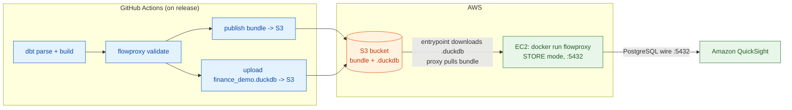

# Plan: end-to-end AWS demo (CI to S3 to EC2 to QuickSight)

Topology and rationale: [ADR-0016](adr/0016-e2e-aws-demo-topology.md).
Goal: an analyst opens QuickSight, connects to a FlowProxy running on AWS, and
slices the finance_demo semantic layer with the semi-additive guardrail holding
- with the manifest bundle and DuckDB file delivered by CI on release.

## Why CI is broken today (diagnosis first)

The current [`.github/workflows/semantic-layer.yml`](../.github/workflows/semantic-layer.yml)
will fail on the `publish` job for concrete reasons - fixing these is WS-D1:

1. **`s3fs` is not installed.** `pyproject.toml` has `fsspec` but no `s3fs`, so
   `open_store("s3://...")` raises at import/resolve. The `--extra duckdb` sync
   does not pull an S3 backend. Need an `aws`/`s3` extra.
2. **`--profiles-template` path is wrong.** The workflow points at
   `profiles.template.yml` but the finance_demo dir must actually contain it
   (it does now) - verify it is committed and referenced correctly.
3. **No AWS auth wired.** The publish job references
   `aws-actions/configure-aws-credentials` only in a comment; it never actually
   authenticates, and `vars.FLOWPROXY_MANIFEST_URI` is unset.
4. **`dbt build` never runs in CI**, so there is no `.duckdb` to upload.
5. **The validate job may fail on `--diff`** when no prior bundle exists - it
   should treat "no deployed bundle" as non-fatal (the code already logs it, but
   confirm the exit path).

## Workstreams

| WS | Deliverable | Touches |
|---|---|---|
| **D1** | Fix CI: add `s3` dependency extra; make `validate` robust with no prior bundle; add `dbt build` + `.duckdb` upload; wire OIDC AWS auth; publish bundle + sidecar to S3 on release | `pyproject.toml`, `.github/workflows/semantic-layer.yml` |
| **D2** | Entrypoint for STORE mode + sidecar: a boot script that downloads the `.duckdb` from S3 to local disk, exports `FLOWPROXY_DUCKDB_PATH`, then execs the proxy. Update Dockerfile ENTRYPOINT | `docker-entrypoint.sh` (rewrite), `Dockerfile` |
| **D3** | The DuckDB profile template for the demo (S3-sourced path resolved to the downloaded local file) | `test_projects/finance_demo/profiles.template.yml` (verify) |
| **D4** | AWS provisioning runbook: S3 bucket, IAM (GitHub OIDC role for CI + EC2 instance role), EC2 launch, security group for 5432, `docker run` invocation | `docs/demo-aws-runbook.md` (new) |
| **D5** | QuickSight connection steps + the demo script (what to click, what numbers to expect) | `docs/demo-aws-runbook.md` |
| **D6** | LICENSE file (unblocks any real use; currently missing) | `LICENSE` |

Sequencing: **D6** (trivial, unblocks) then **D1 + D2 + D3** (make the artifacts
real and consumable) then **D4 + D5** (the AWS + QuickSight runbook). D1-D3 are
code and testable locally with a `file://` or MinIO store before any AWS spend.

## Local dress rehearsal (before AWS spend)

Everything except the EC2/QuickSight legs is testable offline:

1. `dbt build` + `dbt parse` finance_demo -> `.duckdb` + manifest.
2. `flowproxy validate --publish file:///tmp/store --profiles-template ...` ->
   writes a bundle locally (already proven in tests).
3. Copy the `.duckdb` next to it (simulating the sidecar).
4. Run the entrypoint pointed at `file:///tmp/store` with the sidecar path ->
   proxy boots in STORE mode, downloads/locates the `.duckdb`, serves :5432.
5. `psql` the local proxy -> assert AMER 3000 / EMEA 2000.

Only once that green do we spend on AWS. The AWS delta is then just: `file://`
becomes `s3://`, and `docker run` moves from laptop to EC2.

## Cost + teardown (demo hygiene)

- One small EC2 instance + minimal S3 + egress. Dollars, not tens of dollars,
  for a short-lived demo.
- Runbook ends with explicit teardown: terminate EC2, empty + delete bucket,
  delete IAM roles, so nothing lingers billing.

## Explicitly out of scope for the demo (documented as prod deltas in ADR-0016)

- ECS Fargate + NLB (documented migration; demo uses EC2).
- QuickSight VPC connection + private networking (demo uses public + password).
- SCRAM auth / metric ACLs (WS4; demo uses cleartext password).
- A real networked warehouse (demo uses DuckDB sidecar; prod swaps the profile).

## Confirmed decisions (2026-07-04)

- **AWS**: account exists; no bucket convention, no OIDC provider yet - the
  runbook creates everything from scratch.
- **QuickSight**: Standard edition. This *forces* the public + password path
  (VPC connection is Enterprise-only), matching ADR-0016's demo choice.
- **Publish trigger**: `workflow_dispatch` (manual), not release. Less ceremony
  for a demo; still gated (only runs when you click it).
- **Cheapest posture** (drives concrete choices):
  - EC2 **t3.micro** (free-tier eligible; the proxy + a small DuckDB fit).
  - Single AZ, no NLB, no Elastic IP (use the auto-assigned public IP; it
    changes on stop/start, acceptable for a short demo).
  - S3 one bucket, no versioning, `DEEP` nothing - a few small objects.
  - **CI auth via OIDC role** (no stored AWS keys in GitHub) - costs nothing and
    avoids the one thing that actually bites you (leaked long-lived keys).
  - Region: default to **us-east-1** unless the runbook says otherwise (cheapest
    QuickSight + most services); the runbook parameterizes it.
  - Teardown steps included so the free-tier demo leaves no bill.
